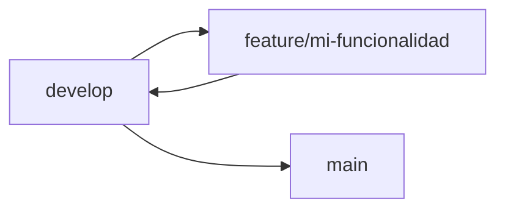
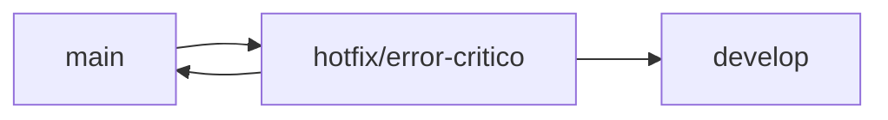

# Tipos de Ramas

Esta guía describe la estrategia de branching y los tipos de ramas utilizados en los proyectos de la Red Sísmica del Austro.

## Contenido
{: .no_toc }

- TOC
{:toc}

---

## Rama `main` o `master`

Es la **rama principal** del repositorio, donde se encuentra la versión estable del proyecto.

- Todo el código en `main` (o `master`) debe estar completamente probado y listo para producción.
- Solo se fusionan cambios en esta rama después de revisiones y pruebas exhaustivas.

---

## Rama `develop`

Esta es la rama principal de desarrollo y sirve como una "versión beta" del proyecto.

- Es donde se fusionan todas las **ramas de características (feature branches)** antes de pasar a `main`.
- `develop` contiene la última versión de las funcionalidades en desarrollo y se utiliza para pruebas de integración.
- Al finalizar y aprobar las pruebas, `develop` se fusiona en `main`.

---

## Ramas de Funcionalidades (`feature/`)

Estas ramas se utilizan para desarrollar **nuevas características** o funcionalidades.

- Normalmente se crean a partir de la rama `develop` y se nombran con el prefijo `feature/`, seguido de una descripción de la funcionalidad, como `feature/login`.
- Una vez completadas y probadas, se fusionan de vuelta en `develop`.

**Ejemplo:**
```shell
git checkout develop
git checkout -b feature/autenticacion-jwt
# ... desarrollo ...
git commit -m "FEAT: Implementada autenticación JWT"
```

---

## Ramas de Corrección (`bugfix/`)

Estas ramas se utilizan para **corregir errores** en el código que aún no ha llegado a producción.

- Se crean a partir de `develop` (si el error es parte de una versión en desarrollo) o a partir de `main` (si es un error crítico en producción).
- Su prefijo es `bugfix/`, seguido de una descripción del problema, como `bugfix/correccion-login`.

**Ejemplo:**
```shell
git checkout develop
git checkout -b bugfix/validacion-formulario
# ... corrección ...
git commit -m "FIX: Corregida validación en formulario de registro"
```

---

## Ramas de Hotfix (`hotfix/`)

Las ramas **hotfix** se utilizan para corregir **errores críticos** en producción que necesitan ser resueltos inmediatamente.

- Se crean a partir de `main` para que los cambios puedan aplicarse rápidamente.
- Luego se fusionan de vuelta en `main` y `develop` para mantener ambas ramas actualizadas.
- Usan el prefijo `hotfix/` seguido de una descripción del problema, como `hotfix/fix-login-error`.

**Ejemplo:**
```shell
git checkout main
git checkout -b hotfix/error-critico-sesion
# ... corrección urgente ...
git commit -m "HOTFIX: Corregido error crítico en gestión de sesiones"
```

---

## Ramas de Soporte (`support/`)

Estas ramas se utilizan para **mantener versiones específicas del proyecto** que están en producción, especialmente cuando se tiene soporte para versiones anteriores.

- Las ramas de soporte permiten aplicar actualizaciones menores, como correcciones de errores, sin afectar la versión más reciente del desarrollo.
- Se suelen nombrar como `support/1.x`, indicando la versión soportada.

**Ejemplo:**
```shell
git checkout -b support/1.x
```

---

## Ramas de Liberación (`release/`)

Las ramas **release** se utilizan para preparar una nueva versión del proyecto antes de enviarla a producción.

- Se crean a partir de `develop` cuando se ha completado el desarrollo de una versión y se encuentra en etapa de prueba y ajuste final.
- En esta rama se realizan ajustes menores, como actualizaciones de la documentación y optimización de código, antes de fusionarla en `main` y en `develop`.
- Se nombran con el prefijo `release/` y la versión de la próxima liberación, como `release/1.0.0`.

**Ejemplo:**
```shell
git checkout develop
git checkout -b release/1.0.0
# ... ajustes finales, documentación ...
git commit -m "DOCS: Actualizada documentación para v1.0.0"
```

---

## Flujo de Trabajo Típico

### Desarrollo de nueva funcionalidad



1. Crear rama desde `develop`: `git checkout -b feature/mi-funcionalidad`
2. Desarrollar y hacer commits con prefijos apropiados
3. Fusionar de vuelta a `develop` mediante Pull Request
4. Cuando `develop` esté listo, fusionar a `main`

### Corrección urgente en producción



1. Crear rama desde `main`: `git checkout -b hotfix/error-critico`
2. Corregir el error rápidamente
3. Fusionar a `main` para producción inmediata
4. Fusionar también a `develop` para mantener sincronización

---

## Resumen de Prefijos

| Prefijo | Origen | Destino | Uso |
|---------|--------|---------|-----|
| `feature/` | `develop` | `develop` | Nuevas funcionalidades |
| `bugfix/` | `develop` | `develop` | Correcciones en desarrollo |
| `hotfix/` | `main` | `main` + `develop` | Correcciones críticas urgentes |
| `release/` | `develop` | `main` + `develop` | Preparación de versiones |
| `support/` | `main` | - | Mantenimiento de versiones antiguas |