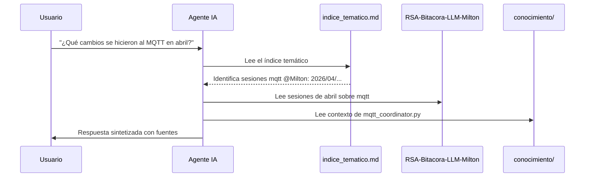

# Consulta de Historiales

El sistema permite recuperar conocimiento pasado mediante consultas al agente en lenguaje natural. El agente utiliza el índice temático federado para localizar los archivos relevantes sin necesidad de leer todo el historial.

---

## Cómo Funciona el Skill `consulta_historica`

Cuando haces una pregunta sobre el pasado, el agente:

1. Lee `rsa/RSA-Metodologias/indice/indice_tematico.md` (el índice maestro).
2. Identifica las secciones relevantes: contextos técnicos, sesiones por entorno o por tema.
3. Resuelve las rutas de los archivos usando el `catalogo_contribuidores.md`.
4. Lee los archivos identificados (máximo 3-5 para no exceder el contexto).
5. Sintetiza una respuesta integrando el contexto técnico y el historial de cambios.



---

## Ejemplos de Consultas

### Consulta por Tema

```
¿Qué decisiones se tomaron sobre el protocolo MQTT del acelerógrafo?
```

El agente buscará en la sección `## Sesiones por Tema > mqtt` del índice y leerá las sesiones más recientes relacionadas.

**Respuesta esperada del agente:**
```
Según las sesiones consultadas:

- 2026-02-03: Se refactorizó el mqtt_coordinator.py para usar un dispatcher
  de comandos basado en registro (registry pattern).
- 2026-04-24: Se revirtió el mecanismo de debouncing porque generaba pérdida
  de eventos en condiciones de alta frecuencia.
- 2026-05-15: Se implementó el sistema de comandos broadcast para enviar
  órdenes a todas las estaciones simultáneamente.

Fuentes consultadas:
- rsa/RSA-Metodologias/indice/indice_tematico.md
- institucional/RSA-Bitacora-LLM-Milton/sesiones/2026/02/2026-02-03_refactorizacion_mqtt_coordinator.md
- institucional/RSA-Bitacora-LLM-Milton/sesiones/2026/04/2026-04-24_reversion_debouncing_mqtt_coordinator.md
- institucional/RSA-Bitacora-LLM-Milton/sesiones/2026/05/2026-05-15_comandos_broadcast_mqtt.md
```

---

### Consulta por Fecha o Período

```
¿En qué trabajamos durante mayo de 2026?
```

El agente buscará todas las entradas del índice que correspondan a `2026/05/` para `@Milton`.

**Respuesta esperada:**
```
Durante mayo de 2026 se trabajaron los siguientes temas:

- 2026-05-11: Extracción remota de eventos miniSEED vía MQTT.
- 2026-05-12: Diseño del layout del dashboard de Node-RED.
- 2026-05-14: Corrección de datos duplicados en Grafana/InfluxDB.
- 2026-05-15: Estabilización del dashboard y comandos broadcast MQTT.
- 2026-05-22: Implementación del quiosco de Grafana en Ubuntu con Wayland.
- 2026-05-26: Configuración de Micromamba en Windows 11.
```

---

### Consulta por Entorno/Proyecto

```
¿Qué se ha hecho en el stack TIG?
```

El agente buscará en `## Sesiones por Entorno > tig`.

---

### Consulta Técnica de Código

```
¿Cómo funciona el extractor de eventos miniSEED?
```

Para este tipo de consulta, el agente prioriza el **contexto técnico** (arquitectura del código) sobre las sesiones:

1. Lee el contexto técnico de `mseed_event_extractor.py` desde `RSA-Acelerografo/docs/context/`.
2. Lee las sesiones de bitácora relacionadas con ese script.
3. Explica la arquitectura actual más los cambios históricos.

---

### Consulta de Decisión de Arquitectura

```
¿Por qué se usó Wayland en lugar de X11 para el quiosco de Grafana?
```

El agente buscará en `## Decisiones de Arquitectura` del índice, y si existe el ADR correspondiente, lo leerá directamente.

---

## Resolución de Rutas entre Repositorios

El índice usa el formato `@Usuario: YYYY/MM/archivo.md`. El agente resuelve estas referencias usando el `catalogo_contribuidores.md`:

| Referencia en el índice | Ruta resuelta en el workspace |
|------------------------|------------------------------|
| `@Milton: 2026/05/2026-05-22_quiosco_grafana_seguro.md` | `institucional/RSA-Bitacora-LLM-Milton/sesiones/2026/05/2026-05-22_quiosco_grafana_seguro.md` |

Cuando se agregue un nuevo contribuidor (ej. `@Remigio`), el agente resolverá sus sesiones automáticamente si su repositorio está registrado en el catálogo.
