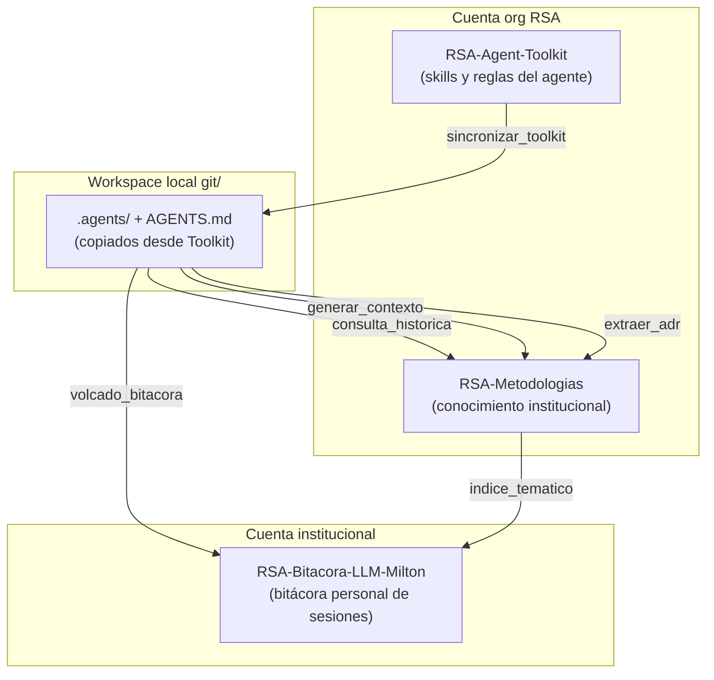

# Exocortex RSA

El **Exocortex RSA** es el sistema de memoria externa asistido por inteligencia artificial del equipo de la Red Sísmica del Austro. Su objetivo es preservar, organizar y hacer recuperable el conocimiento técnico acumulado durante el desarrollo y mantenimiento de los proyectos de la RSA.

## ¿Qué es un Exocortex?

Un exocortex (del latín *exo* = externo, y *cortex* = corteza cerebral) es un sistema externo que extiende las capacidades cognitivas humanas, funcionando como una memoria persistente que puede ser consultada por humanos y por agentes de IA.

En el contexto de la RSA, el exocortex cumple tres funciones:

1. **Memoria semántica**: Documentación estructurada de la arquitectura técnica de cada proyecto (cómo funciona el código, qué hace cada componente).
2. **Memoria episódica**: Bitácoras cronológicas de las sesiones de trabajo con agentes de IA (qué se hizo, qué se decidió, cuándo).
3. **Memoria de decisiones**: Registro de las decisiones de arquitectura más importantes y sus justificaciones.

## Arquitectura del Sistema

El exocortex está distribuido en tres repositorios:

## Contenido de esta Sección

- **[Despliegue](despliegue.md)**: Cómo instalar y configurar el sistema completo.
- **[Gestión de Sesiones](sesiones.md)**: Cómo guardar y actualizar bitácoras de trabajo.
- **[Consulta de Historiales](consultas.md)**: Cómo buscar conocimiento pasado.
- **[Contexto Técnico](contexto-tecnico.md)**: Cómo documentar la arquitectura de proyectos.
- **[Decisiones de Arquitectura (ADR)](adr.md)**: Cómo documentar decisiones técnicas.
- **[Sincronización y Mantenimiento](sincronizacion.md)**: Cómo mantener el sistema actualizado.
