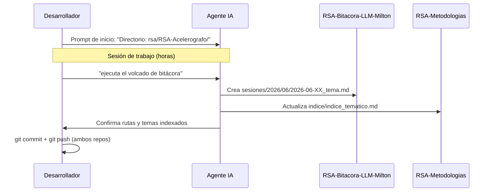

# Sincronización y Mantenimiento

Esta guía cubre cómo mantener el exocortex actualizado: actualizaciones del toolkit, sincronización del workspace y administración de contribuidores.

---

## Actualizar el Toolkit

Cuando se publique una nueva versión del `RSA-Agent-Toolkit` (nuevos skills, reglas actualizadas), sigue este flujo:

### 1. Obtener los cambios

```bash
cd ~/git/rsa/RSA-Agent-Toolkit
git pull
```

### 2. Sincronizar al workspace raíz

En la próxima sesión con el agente, escribe:

```
sincroniza el toolkit
```

El agente ejecuta el skill `sincronizar_toolkit` y:

1. Lee cada archivo desde `rsa/RSA-Agent-Toolkit/.agents/`.
2. Sobrescribe los archivos correspondientes en `git/.agents/`.
3. Sobrescribe `git/AGENTS.md` con la versión nueva.
4. Confirma los archivos actualizados.

**Salida esperada:**
```
✅ Toolkit sincronizado. Archivos actualizados en git/.agents/:
   rules/commits.md
   rules/restriccion_sshfs.md
   rules/idioma.md
   skills/volcado_bitacora.md
   skills/consulta_historica.md
   skills/generar_contexto.md
   skills/extraer_adr.md
   skills/sincronizar_toolkit.md
✅ git/AGENTS.md actualizado.

Los cambios tendrán efecto en la próxima conversación.
```

> **Nota**: Los cambios en `.agents/` y `AGENTS.md` tienen efecto a partir de la **siguiente** sesión del IDE, no en la actual.

---

## Compatibilidad W11 y WSL

El skill `sincronizar_toolkit` es multiplataforma: funciona igual en Windows 11 y en WSL/Linux porque usa operaciones de escritura de archivos del agente, no comandos de shell.

| Entorno | Workspace raíz | Comando de activación |
|---------|---------------|----------------------|
| Windows 11 | `C:\Users\Usuario\Documents\git\` | `sincroniza el toolkit` |
| WSL / Linux | `~/git/` | `sincroniza el toolkit` |

No se requieren scripts, alias ni symlinks.

---

## Flujo Completo de una Jornada de Trabajo



---

## Agregar un Nuevo Contribuidor

Cuando un nuevo miembro del equipo quiera usar el exocortex:

### Paso 1: Crear el repositorio de bitácora

En la cuenta institucional del nuevo miembro, crear el repositorio:
`RSA-Bitacora-LLM-{Nombre}`

### Paso 2: Registrar en el catálogo

Edita `rsa/RSA-Metodologias/indice/catalogo_contribuidores.md` y agrega una fila:

```markdown
| @Remigio | Remigio A. | RSA-Bitacora-LLM-Remigio | institucional | `institucional/RSA-Bitacora-LLM-Remigio/sesiones/` |
```

### Paso 3: Clonar y desplegar

El nuevo miembro sigue el proceso completo de [Despliegue](despliegue.md).

---

## Ciclo de Mantenimiento Recomendado

| Frecuencia | Acción |
|-----------|--------|
| **Al finalizar cada sesión** | Volcado de bitácora + commit + push en bitácora y Metodologías |
| **Al hacer un cambio arquitectónico** | Generar o actualizar el contexto técnico del componente |
| **Al tomar una decisión importante** | Extraer un ADR |
| **Al publicar nueva versión del Toolkit** | `git pull` en RSA-Agent-Toolkit + `sincroniza el toolkit` |
| **Al agregar un colaborador** | Crear repo de bitácora + registrar en catálogo |
