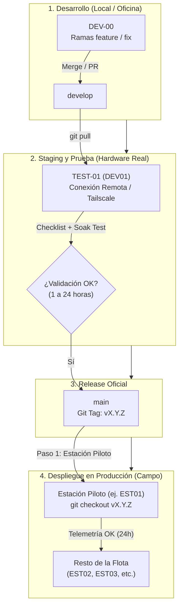

# Protocolo de Despliegue y Release RSA
{: .no_toc }

Metodología institucional para el desarrollo, validación en staging, versionado semántico y despliegue seguro en estaciones sísmicas remotas de la Red Sísmica del Austro.

## Contenido
{: .no_toc }

- TOC
{:toc}

---

## Objetivo y Filosofía

Para estaciones sísmicas remotas instaladas a decenas de kilómetros en zonas de difícil acceso, un fallo de software o un reinicio defectuoso implica pérdida crítica de datos sismológicos y traslados logísticos costosos.

Este protocolo establece un flujo de **Despliegue Escalonado con Puertas de Calidad (Quality Gates)** y **Versionado Semántico Inmutable**, garantizando que ningún código llegue a las estaciones de producción en campo sin haber sido validado previamente en hardware idéntico bajo condiciones reales de operación.



---

## 1. Topología y Roles de Estaciones

| Nivel | Identificador | Rama Git | Rol Operativo | Ubicación y Conexión | Criterio de Riesgo |
|---|:---:|:---:|---|---|---|
| **Desarrollo** | `DEV-00` | `feature/*`<br>`fix/*` | Banco de trabajo principal para edición de código, compilación cruzada y pruebas unitarias. | Oficina (Acceso físico directo) | Riesgo controlado |
| **Staging / Test** | `TEST-01`<br>*(antes DEV01)* | `develop` | **Banco de Pruebas**: Hardware real idéntico al de campo. Validación de despliegues y pruebas de estrés. | Laboratorio / Remoto (Tailscale) | Acepta fallos para depuración |
| **Producción** | `PROD-*`<br>*(EST01, EST02, etc.)* | `main`<br>*(Tags fijos)* | **Estaciones de Campo**: Adquisición sísmica continua, conversión miniSEED y telemetría oficial. | Red de monitoreo en campo | **Cero tolerancia a fallos** |

> **Regla de Identificación**: Las estaciones de desarrollo y prueba deben configurar su identificador explícito (`DEV0` o `TEST01`) en `configuracion_maestra.json` para no contaminar los tópicos MQTT ni los dashboards de producción en Grafana.

---

## 2. Estructura de Versionado Semántico (SemVer)

Los repositorios de software y firmware de la RSA siguen el estándar [Semantic Versioning (SemVer 2.0.0)](https://semver.org/lang/es/):

### Formato de Versión: `vMAJOR.MINOR.PATCH`

```text
  v 4 . 5 . 1
    │   │   └── PATCH: Correcciones de bugs, mejoras de resiliencia (sin romper APIs)
    │   └────── MINOR: Nuevos subsistemas, daemons o features compatibles hacia atrás
    └────────── MAJOR: Cambios estructurales mayores, nuevo formato binario/hardware
```

### Criterios de Incremento para Acelerógrafos RSA:

1. **`MAJOR` (`vX.0.0`)**:
   - Cambios incompatibles en el protocolo binario SPI de tramas dsPIC-RPi.
   - Reestructuración profunda del pipeline (ej. `v4.0.0` introdujo el Ring Buffer rotativo en disco y la inferencia de fases sísmicas con IA GPD).
2. **`MINOR` (`v4.X.0`)**:
   - Nuevos componentes, daemons bajo Supervisor o servicios de sistema compatibles (ej. `v4.1.0` panel web de configuración local, `v4.4.0` watchdog de adquisición MQTT, `v4.5.0` gobernanza completa por Systemd y reseteo por hardware del dsPIC).
3. **`PATCH` (`v4.5.X`)**:
   - Correcciones de errores, blindaje de excepciones y ajustes de robustez (ej. `v4.5.1` espera activa dinámica de reloj NTP con `wait_for_ntp` y auto-habilitación en boot).

---

## 3. Gestión del Registro de Cambios (CHANGELOG.md)

Todos los repositorios deben mantener un archivo `CHANGELOG.md` en la raíz siguiendo el estándar [Keep a Changelog](https://keepachangelog.com/es-ES/1.0.0/).

### Estructura y Categorías:
- **`Añadido` (Added)**: Nuevas funcionalidades o scripts.
- **`Modificado` (Changed)**: Cambios en comportamiento existente.
- **`Corregido` (Fixed)**: Corrección de bugs o fallos operacionales.
- **`Eliminado` (Removed)**: Funcionalidades obsoletas deprecadas.
- **`Seguridad` (Security)**: Mejoras de autenticación o cifrado.

### Flujo de Trabajo del Changelog:
1. Durante el desarrollo activo en ramas `feature/*` o `develop`, los cambios se documentan bajo la sección preliminar **`## [Unreleased]`**.
2. Al momento de certificar una versión en `TEST-01`, se reemplaza `## [Unreleased]` por el tag formal con su fecha (ej. `## [v4.5.1] — 2026-09-03`).

---

## 4. Protocolo de Despliegue en 4 Fases

### Fase 1: Desarrollo en `DEV-00`
1. Crear una rama de trabajo a partir de `develop`:
   ```bash
   git checkout develop
   git pull origin develop
   git checkout -b feature/nuevo-watchdog
   ```
2. Implementar cambios, pasar pruebas unitarias locales (`pytest`):
   ```bash
   pytest scripts/operation/streaming/ -v
   ```
3. Fusionar en `develop` y subir al repositorio remoto:
   ```bash
   git checkout develop
   git merge feature/nuevo-watchdog
   git push origin develop
   ```

---

### Fase 2: Validación en Staging (`TEST-01`)
Conectarse por SSH/Tailscale a la estación de prueba `TEST-01`:

1. **Actualización del Repositorio y Despliegue**:
   ```bash
   cd <directorio_del_proyecto>
   git checkout develop
   git pull origin develop
   ./menu.sh  # Seleccionar Opción 3 (Actualizar el proyecto)
   ```

2. **Checklist Obligatorio de Aprobación**:
   - [ ] **Habilitación de Servicio**: `systemctl is-enabled rsa-acelerografo.service` responde `enabled`.
   - [ ] **Arranque y Named Pipe**: `registrocontinuo restart` inicia sin excepciones y crea `/tmp/my_pipe` con permisos `0666`.
   - [ ] **Lectura Activa**: El comando `comprobar` muestra tramas continuas y crecimiento del archivo `.dat`.
   - [ ] **Reinicio en Frío y Sincronización NTP**:
     ```bash
     sudo reboot
     # Tras encender:
     tail -n 25 <directorio_de_logs>/registro_continuo.log
     # Debe registrar: "INFO - Sincronizacion NTP: Si" (sin warnings).
     ```
   - [ ] **Telemetría MQTT**: Verificar en MQTT Explorer que publique `status/system` y `status/acquisition` con `age_seconds < 10`.

3. **Prueba de Remojo (*Soak Test*)**:
   - Dejar correr la estación **mínimo 1 ciclo de rotación horaria (1 hora)** para certificar que a las `XX:00:00` cierre el archivo `.dat`, ejecute la conversión a miniSEED y suba a almacenamiento remoto sin fugas de memoria.
   - Para cambios en código C (`registro_continuo`) o modificaciones de kernel/systemd, el Soak Test recomendado es de **24 horas**.

---

### Fase 3: Promoción a `main` y Etiquetado Inmutable
Una vez que `TEST-01` certifica el Soak Test sin anomalías:

1. **Sellar el Changelog en `develop`**:
   En el equipo de desarrollo, editar `CHANGELOG.md` convirtiendo `## [Unreleased]` en `## [v4.5.1] — YYYY-MM-DD`.
   ```bash
   git add CHANGELOG.md
   git commit -m "chore(release): preparar release v4.5.1"
   git push origin develop
   ```

2. **Fusionar `develop` hacia `main`**:
   ```bash
   # Cambiar a la rama principal de producción
   git checkout main
   git pull origin main

   # Fusionar los cambios aprobados desde develop
   git merge develop -m "merge: sincronizar main con develop para release v4.5.1"
   git push origin main
   ```

3. **Crear y Publicar el Git Tag Anotado**:
   > **Regla de Oro**: Los tags de versión oficial **se crean y envían exclusivamente desde `main`**.

   ```bash
   git tag -a v4.5.1 -m "Release v4.5.1: Pipeline resiliente con Systemd, sincronización dinámica NTP y auto-habilitación en boot"
   git push origin v4.5.1
   ```

---

### Fase 4: Despliegue Canario en Campo (Canary Deployment)

**Nunca actualizar todas las estaciones remotas al mismo tiempo.**

1. **Despliegue en Estación Piloto (Canary)**:
   - Conectarse por SSH/Tailscale a la estación piloto de campo (ej. `EST01`):
     ```bash
     cd <directorio_del_proyecto>
     git fetch --tags
     git checkout v4.5.1
     ./menu.sh  # Opción 3 (Actualizar el proyecto)
     ```
   - Monitorear durante **24 horas** en los paneles de Grafana:
     - Continuidad de trazas sísmicas.
     - Latencia de adquisición (`status/acquisition`).
     - Subida horaria a almacenamiento en la nube.

2. **Despliegue General en la Flota**:
   - Tras 24 horas exitosas en la estación piloto, repetir el procedimiento de actualización en el resto de estaciones (`EST02`, `EST03`, etc.).

---

## 5. Plan de Contingencia y Rollback Inmediato

Si una estación de campo remota presenta anomalías críticas tras una actualización:

```bash
# Restauración instantánea a la versión previa estable (ej. v4.5.0):
cd <directorio_del_proyecto>
git fetch --tags
git checkout v4.5.0
./menu.sh  # Opción 3 (Recompila e instala la versión previa)
sudo reboot
```

---

## Resumen de Buenas Prácticas

1. **`main` es intocable directamente**: Todo cambio entra a `main` únicamente tras aprobar las pruebas en `TEST-01`.
2. **Producción consume Tags inmutables**: En campo se hace `checkout vX.Y.Z` en lugar de seguir la punta de una rama móvil, evitando descargas accidentales de código intermedio.
3. **El Soak Test es innegociable**: Ningún release pasa a campo sin al menos 1 rotación horaria completa en hardware real.
4. **Sincronización Total**: Toda actualización de software en el acelerógrafo debe acompañarse de su contexto técnico en `docs/context/` y su registro en `CHANGELOG.md`.
